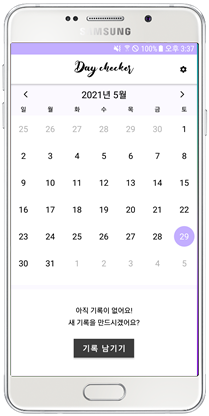
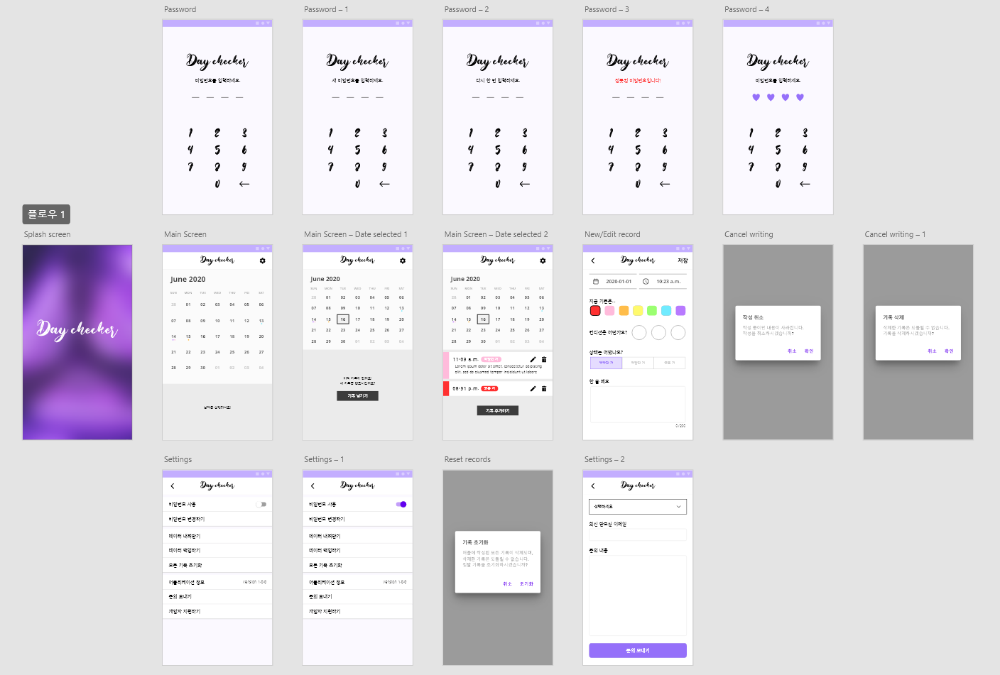
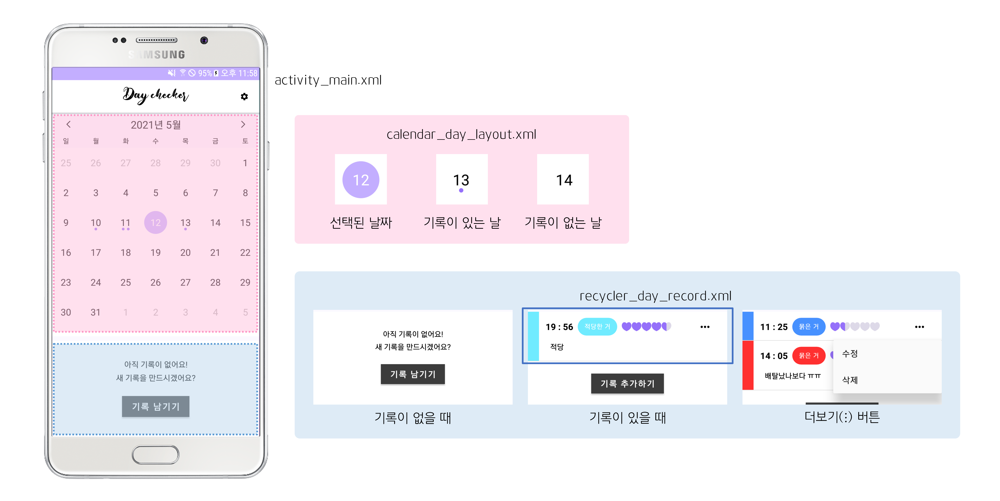
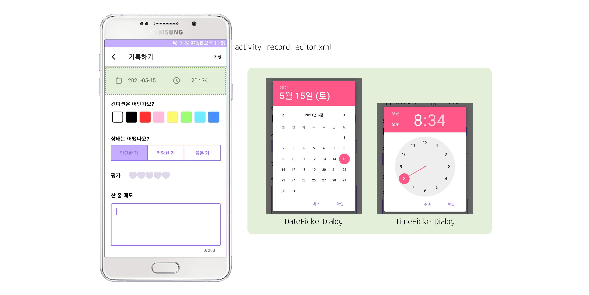
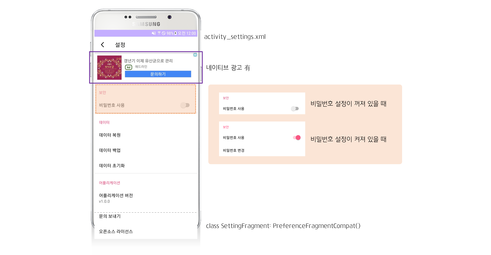
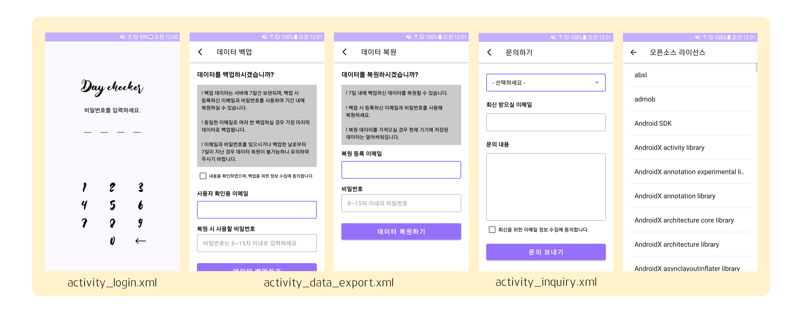

# 데이체커 DayChecker 
   

## 프로젝트 소개

### 프로젝트 개요

> 화장실에 다녀오는 빈도수와 그 상태가 건강 상태를 확인할 수 있는 척도이기도 하다는 점을 알고 계신가요? 오늘은 화장실에 몇 번 다녀오셨나요? 변비이거나, 설사하거나, 배탈 나지는 않았나요? 오늘 당신의 화장실 건강은 어떤가요?

- 용변의 상태가 건강 상태의 지표 중 하나라는 점에 착안하여 제작한 어플입니다.
- 매일 화장실에 다녀온 횟수와 그 시각, 상태를 평가하여 기록할 수 있습니다. 
- 모든 데이터는 오직 사용자의 기기에만 저장되며 앱 자체에도 비밀번호를 설정할 수 있습니다.
- 필요에 따라 데이터 백업과 복원도 가능합니다.

### 목업

프로젝트 시작 전 구상한 목업으로, 최종 구현 결과물과는 다소 차이가 있습니다.

### 실행 방법

#### Play 스토어에서 다운받는 경우
 
[설치 링크](https://play.google.com/store/apps/details?id=com.projectteamo.daychecker)
 
#### 코드를 내려받아 실행하는 경우
 
데이체커는 외부 패키지로 [kizitonwose/CalendarView](https://github.com/kizitonwose/CalendarView)를 추가해 사용하고 있습니다.  
코드를 직접 실행하실 경우, 반드시 해당 패키지를 다운로드 받고 import 해야 정상적으로 실행됩니다.
 
 

## 실행화면 및 사용 흐름
### 메인 화면

메인화면에서는 캘린더와 함께 특정 날짜의 기록을 확인할 수 있는 리스트를 제공합니다. 어플리케이션을 처음 시작하면 기본적으로 오늘 날짜가 선택되어 있습니다.
-   **캘린더:** 날짜를 선택하여 그날 작성된 기록을 확인하거나 새 기록을 작성할 수 있습니다.
    -   `com.kizitonwose.calendarview.CalendarView` 사용 - 일부 커스텀 적용
    -   좌우로 스와이핑 하거나 화살표를 눌러 다른 달로 이동할 수 있으며, 이때 그달의 1일이 자동으로 선택됩니다. 또한 가장 위의 어플리케이션 로고를 눌러 바로 오늘 날짜로 이동할 수 있습니다.
    -   날짜 하단에는 기록 수만큼 작은 점이 찍히며, 기록의 수와 관계없이 최대 3개까지만 보입니다.
-   **기록 리스트:** 선택한 날짜의 기록을 작성한 시간순으로 볼 수 있습니다.
    -   기록이 없으면 아직 기록이 없다는 메시지와 버튼, 있으면 해당일의 기록과 버튼이 보입니다.
    -   각 기록의 우측 더보기 버튼을 눌러 기록을 수정하거나 삭제할 수 있습니다.

### 기록 에디터

메인 화면에서 '기록 남기기' 또는 '기록 추가하기' 버튼을 누르거나 기록의 더보기 메뉴에서 '수정' 버튼을 눌러 에디터 화면을 열 수 있습니다. 에디터는 간결한 단일 페이지로 구성되어 있으며, 저장 버튼은 편리성을 고려하여 페이지 상단 우측에 있습니다.
-   **날짜 선택**: 상단의 날짜를 누르면 팝업으로 기록일을 선택할 수 있는 달력이 뜹니다.
-   **시간 선택**: 마찬가지로 상단의 시간을 누르면 기록의 시간을 택할 수 있는 시계 팝업이 뜹니다.
-   **컨디션 & 상태**: 라디오박스 형식 버튼으로, 상태를 선택하고 컨디션을 표현할 색을 고를 수 있습니다.
-   **평가**: 레이팅바 형식으로, 터치 및 드래그 방식으로 기록에 평점을 남길 수 있습니다.
-   **한 줄 메모**: 최대 200자의 메모를 남길 수 있으며, 필수가 아니므로 아무것도 적지 않아도 됩니다.

### 설정 페이지

설정 페이지는 세 개의 카테고리로 분류되어 있으며, 위에서부터 보안 (비밀번호 설정), 데이터, 어플리케이션 정보 순서로 나열되어 있습니다. 가장 상단에는 네이티브 형식의 구글 광고가 삽입되어 있습니다. 이는 아래의 설정 목록과는 분리되어 있어 스크롤을 내려도 올라가거나 가려지지 않습니다.

각 메뉴를 선택했을 때 열리는 페이지의 형태는 아래와 같습니다.

-   **비밀번호 설정**: 어플리케이션을 시작할 때 비밀번호를 입력하도록 설정할 수 있습니다.
    -   비밀번호는 4자리 숫자로 구성됩니다.
    -   어플리케이션을 시작하거나 백그라운드에서 포그라운드로 가져올 때 잠금이 실행됩니다.
-   **데이터 백업/복원**: 디바이스에 저장된 데이터를 서버에 백업하거나 서버로부터 받아올 수 있습니다.
    -   식별에 이메일과 비밀번호를 사용하며, 7일 이내의 백업 데이터만 내려받을 수 있습니다.
-   **문의하기**: 어플리케이션 관련 문의를 보낼 수 있는 페이지입니다.
    -   카테고리로는 어플 이용 문의, 오류 관련 문의, 데이터 삭제/백업 문의, 기타 문의가 있습니다.

'데이터 초기화'와 '어플리케이션 설정'은 새 페이지가 열리는 대신, 각각 의사를 재확인하는 다이얼로그 팝업과 Toast 메시지가 나타납니다.
 
 

## 주요 기능 구현 방식

### 앱 잠금 비밀번호
- **호출 상태 확인**
    - 어플리케이션 시작, 비밀번호 설정, 기존 비밀번호 수정, 비밀번호 사용 설정 해제
    - 각 상황에서의 처리 방식이 모두 다르므로 어떤 상태에서 호출되었는지 알아야 함
    - 액티비티가 호출될 때 넘겨받은 extra 값을 이용해 해결
        `calledState = intent.getIntExtra(AppLockState.varName, 0)`

- **버튼 터치 처리**
	- 조건 분기문을 간결하게 작성하기 위하여 각 버튼의 입력을 정숫값으로 치환
  - 숫자 버튼인지 지우기 버튼인지 확인하고, 또 각각에 대해 숫자 4개가 모두 입력되었는지, 길이가 0인데 지우기를 누른 것은 아닌지 확인하여 적절하게 처리

- **입력값 처리**
    - 숫자 4개가 모두 입력되면, 마찬가지로 호출 상태에 따라 알맞은 루틴 진행
    - 비밀번호 신규 설정인 경우 처음 입력된 값은 임시로 저장해놓고 다시 한번 입력을 받고, 두 번째로 입력된 값이면 처음 받아둔 값과 비교
    - 이외의 경우 기존에 설정해 둔 비밀번호와 입력값을 비교하고, 일치하는지 아닌지에 따라 처리

잠금 화면은 어플리케이션을 처음 시작할 때와 디바이스가 슬립 상태에서 깨어날 때, 프로세스를 백그라운드로 돌려놓았다가 다시 포그라운드로 끌어올 때 각각의 상황 모두에서 열려야 합니다. 이는 크게 보면 모두 어플리케이션이 포그라운드로 진입할 때의 상황이므로, `LifecycleObserver`를 사용하여 `@OnLifecycleEvent(Lifecycle.Event.ON_START)`에서 로그인 액티비티를 띄우도록 했습니다. 또한 잠금화면이 스택 최상단에 오도록 `FLAG_ACTIVITY_NEW_TASK`와 `FLAG_ACTIVITY_SINGLE_TOP` 플래그도 설정해주었습니다.  

### 데이터베이스: Room과 Firebase
어플리케이션 내부에서 데이터베이스의 사용 흐름은 아래와 같습니다.

1.  어플리케이션을 시작하면 DB에서 각 날짜의 기록 개수 `count(*) + GROUP BY`를 읽어온다. 그 결괏값에 맞추어 메인 화면 캘린더의 각 날짜 아래에 점을 표시해준다.
2.  캘린더에서 특정 날짜를 선택하면 DB에서 해당 날짜의 기록을 모두 읽어와 캘린더 아래의 기록 목록(RecyclerView)에 뿌려준다.
3.  기록을 추가하거나(Insert), 수정하거나(Update), 삭제하는 동작(Delete)에 따라 DB에 접근한다.
4.  사용자가 데이터를 초기화할 경우 DB에 저장된 모든 레코드를 삭제한다. (Drop X)

데이터를 백업하거나 복구할 때에는 데이터를 보관할 별도의 공간이 필요한데, 이에 Firebase의 Firestore과 Storage를 사용하였습니다. 데이터 백업과 복구 과정은 다음과 같이 진행됩니다.

1. 데이터 백업을 선택하면 먼저 모든 트랜잭션 결과 반영을 보장하기 위해 체크포인트를 생성한다.
2. 어플리케이션 데이터베이스 파일을 Firebase로 전송한다. 이때 데이터베이스 파일의 위치는 경로 `(DB이름).openHelper.writableDatabase.path`에서 찾을 수 있고, 파일을 올리는 것이므로 putStream 방식을 사용한다.
3. DB 파일은 Firebase Storage에 클라이언트의 `UUID.randomUUID()`를 이름으로 하여 저장된다. Storage는 중복 이름을 허용하지 않으므로, 사용자가 데이터를 여러 번 백업해도 저장소에는 가장 마지막에 백업한 파일만 저장된다.
4. Storage에 파일을 저장하는 것에 성공하면 사용자가 입력한 비밀번호, 파일이 저장된 Storage 경로, 백업을 실행한 날짜를 Firebase Firestore에 신규 문서로 저장한다. 이때 Firestore 문서의 이름은 사용자가 입력한 이메일이 된다.
5. 이후 데이터를 복원하고자 하면 먼저 입력한 이메일을 이름으로 하는 문서가 있는지 확인하고, 비밀번호가 일치하고 해당 문서의 날짜가 만료기한(7일) 이내인지 확인한 후, 모든 조건에 맞으면 Storage 경로에 접근하여 저장된 DB 파일을 내려받는다.  
6. 디바이스의 DB 파일을 5에서 내려받은 파일로 교체하면 복원이 완료된다.
 

## 크레딧
아래는 데이체커 프로젝트를 진행하며 사용한 외부 라이브러리와 참고한 자료입니다.
- CalendarView
	- 메인 화면의 캘린더뷰는 [Kizito Nwose](https://github.com/kizitonwose)의 [CalendarView](https://github.com/kizitonwose/CalendarView)를 사용하고 있습니다.
	- 위 라이브러리는 MIT 라이센스를 통해 배포되었습니다.
- 앱 잠금 화면
	- https://wooooooak.github.io/android/2020/05/29/In_App_Screen_Lock_%EA%B5%AC%ED%98%84_%EC%9D%B4%EC%8A%88/
- 데이터베이스 백업 및 복원
	- https://androidexplained.github.io/android/room/2020/10/03/room-backup-restore.html
